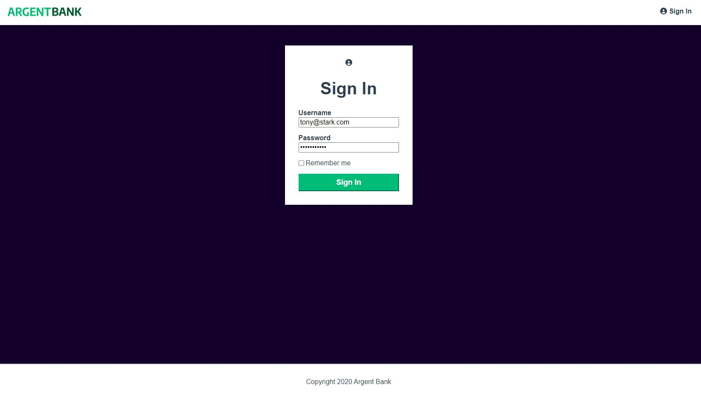

# OC-P13-Argent-Bank

**Front end argent bank**
<kbd></kbd>

> PROBLEMATIQUE
> Créer une application web React pour le nouveau système d'authentification des utilisateurs

> BESOIN
> phase 1 : Authentification des utilisateurs.
> phase 2 : Transactions

## Compétences développées

- [x] Récupérer les données depuis l'API
- [x] Manipuler / Corriger les données selon le besoin
- [x] Utiliser Redux pour gérer le state de l'ensemble de l'application
- [x] Développer des Routes publique et privée avec react-router-dom 6
- [x] Gérer les différents cas liés à la réponse de la requête API
- [x] Développer une logique de code partitionné dans des composants réutilisables
- [x] modélisées l' API côté back end pour la phase 2 avec Swagger
